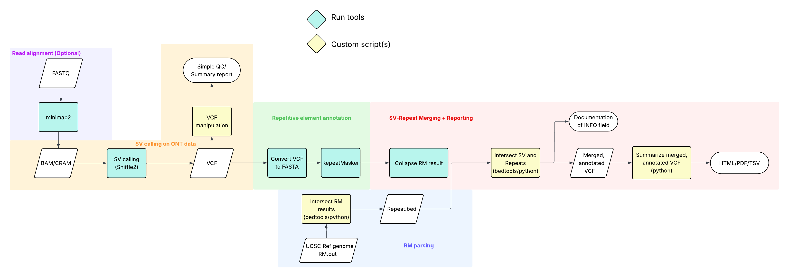

# TRACE - Transposable Element Recognition and Comprehensive Evaluation

A comprehensive one-click user-friendly pipeline for annotating structural variants with transposable element information.

**Hackathon team**: Michal Izydorczyk, Thomas X. Garcia, John Adedeji, Wai Yee (Nicola) Wong, Julian Chiu

presentation for v1.0: [Hackaton 2025 TRACE](https://docs.google.com/presentation/d/16YswBMoNMfBRl4ghd0mH6T2pdR_yx6AWvpaj-cF_t-M/edit?usp=sharing)

## Overview

Structural variations (SVs) are a major source of genomic variation and can exert significant effects on gene regulation, genome integrity, and disease susceptibility. Recent advances in long-read sequencing technologies have substantially improved the resolution and accuracy of SV detection, enabling the identification of previously inaccessible variant types. Transposable elements (TEs) represent an important subset of SVs, contributing to genomic rearrangements and regulatory alterations across diverse biological contexts.

We present **TRACE** (**T**ransposable element **R**ecognition **A**nd **C**omprehensive **E**valuation), an integrated and user-friendly pipeline designed to annotate structural variant VCF files (from Sniffles or similar SV callers) to identify and annotate transposable element content within insertions, deletions, duplications, and other structural variants. The pipeline combines RepeatMasker analysis for insertion sequences with genomic intersection analysis for other SV types.

## Pipeline Workflow



```
Input VCF → 
├── INS variants → vcf2fasta → RepeatMasker → out2bed → squash → ┐
└── DEL/DUP/BND → vcf2bed → bed_processor → bedtools intersect → squash → ┤
                                                                              └→ annotate_vcf → Annotated VCF
```

## Installation

### Prerequisites

1. **Conda/Miniconda** - Required for environment management
2. **Python 3.10+** - Required for pipeline scripts
3. **Sniffles 2.6.3+** - For initial SV calling (separate installation)
4. **RepeatMasker 4.1.5+** - For transposon annotation
5. **bedtools 2.31.0+** - For genomic intersections

### Quick Setup

```bash
# Clone the repository
git clone https://github.com/yourusername/TRACE.git
cd TRACE

# Install dependencies
pip install -r requirements.txt

# Install RepeatMasker (in separate conda environment)
conda create -n repeatmasker python=3.10 -y
conda activate repeatmasker
# Follow RepeatMasker installation instructions below

# Install bedtools
conda install -c bioconda bedtools
```

### RepeatMasker Installation

RepeatMasker requires a separate conda environment due to NumPy version conflicts:

```bash
# Create and activate environment
conda create -n repeatmasker python=3.10 -y
conda activate repeatmasker

# Install dependencies
pip install numpy==1.24.3 h5py
conda install perl -y

# Install TRF (Tandem Repeat Finder)
wget https://github.com/Benson-Genomics-Lab/TRF/releases/download/v4.09.1/trf409.linux64
chmod +x trf409.linux64
mv trf409.linux64 $CONDA_PREFIX/bin/trf

# Clone and configure RepeatMasker
git clone https://github.com/Dfam-consortium/RepeatMasker.git $CONDA_PREFIX/RepeatMasker

# Install RMBlast
wget http://www.repeatmasker.org/rmblast/rmblast-2.14.1+-x64-linux.tar.gz
tar -xzf rmblast-2.14.1+-x64-linux.tar.gz
cp rmblast-2.14.1/bin/* $CONDA_PREFIX/bin/
rm -rf rmblast-2.14.1*

# Download Dfam database (root partition)
mkdir -p $CONDA_PREFIX/RepeatMasker/Libraries/famdb
cd $CONDA_PREFIX/RepeatMasker/Libraries/famdb
wget https://www.dfam.org/releases/current/families/FamDB/dfam39_full.0.h5.gz
gunzip dfam39_full.0.h5.gz

# Configure RepeatMasker
cd $CONDA_PREFIX/RepeatMasker
perl configure -trf_prgm $CONDA_PREFIX/bin/trf -rmblast_dir $CONDA_PREFIX/bin -default_search_engine rmblast

# Create symlink
ln -sf $CONDA_PREFIX/RepeatMasker/RepeatMasker $CONDA_PREFIX/bin/RepeatMasker
```

### Sniffles Installation

Sniffles requires a separate environment due to different NumPy requirements:

```bash
# Create conda environment
conda create -n sniffles python=3.10 -y

# Install Sniffles and dependencies
conda install -n sniffles -c bioconda -c conda-forge \
    sniffles=2.6.3 \
    pysam>=0.21.0 \
    edlib>=1.3.9 \
    psutil>=5.9.4 \
    numpy>=2.2.0 \
    samtools \
    -y

# Activate environment
conda activate sniffles
```

## Usage

### Basic Usage

```bash
python TRACE.py input.vcf \
    --intersect hg38.fa.bed \
    --lib Dfam-RepeatMasker.lib \
    --threads 24

# Output: input_annotated.vcf with RM_TE annotations in INFO field
```

### Full Command with Options

```bash
python TRACE.py input.vcf \
    --intersect hg38.fa.bed \
    --lib /path/to/Dfam-RepeatMasker.lib \
    --threads 24 \
    --keep-intermediates \
    --log-file pipeline.log \
    --debug
```

### Command-Line Arguments

- `input_vcf` - Input VCF file from Sniffles or other SV caller (required)
- `--intersect` - Path to BED file for genomic intersections, e.g., hg38.fa.bed (required)
- `--lib` - Path to RepeatMasker library file (required)
- `--threads` - Number of threads for RepeatMasker (default: 1)
- `--keep-intermediates` - Keep all intermediate files generated during pipeline
- `--remove-log` - Remove the pipeline log file after completion
- `--log-file` - Custom log file path (default: TRACE_pipeline_TIMESTAMP.log)
- `--debug` - Enable debug logging

## Pipeline Components

### 0. TRACE.py
Master orchestrator that handles the below scripts, RepeatMasker, and BedTools Intersect. 

### 1. vcf2fasta.py
Extracts insertion sequences from VCF files and converts them to FASTA format for subsequent RepeatMasker analysis.

### 2. out2bed.py
Converts RepeatMasker output to BED format for downstream processing.

### 3. squash_repeat_masker.py
Consolidates multiple RepeatMasker annotations per variant into single rows with comma-delimited fields.

### 4. vcf2bed.py
Converts structural variants (DEL, DUP, BND) from VCF to BED format with enhanced BND parsing.

### 5. bed_processor.py
Processes BED files by extending deletion coordinates and creating flanking regions for duplications/inversions prior to BedTools Intersect handled by TRACE.py.

### 6. squash_intersect.py
Consolidates multiple intersection results per variant into single rows with comma-delimited fields.

### 7. annotate_vcf.py
Merges annotation data from both pipelines into the original VCF file's INFO field as the RM_TE tag.

## Reference Data

### hg38.fa.bed
The hg38.fa.bed file contains RepeatMasker annotations for the human genome and can be generated from UCSC data:

```bash
# Download and process UCSC RepeatMasker track
wget https://hgdownload.soe.ucsc.edu/goldenPath/hg38/bigZips/hg38.fa.out.gz
pigz -d hg38.fa.out.gz
python out2bed.py hg38.fa.out hg38.fa.bed
```

### Custom Repeat Libraries
Custom repeat libraries can be used instead of the default Dfam database:
- Format: FASTA file with repeat consensus sequences
- Usage: Specify with `--lib` parameter

## Example Workflow

### Starting from BAM file

```bash
# 1. Call structural variants with Sniffles
conda activate sniffles
sniffles \
    --threads 84 \
    --sample-id HG002_GRCh38_ONT-UL \
    --output-rnames \
    --cluster-merge-pos 150 \
    --input HG002.bam \
    --reference GRCh38.fasta \
    --vcf HG002.sniffles.vcf

# 2. Run TRACE pipeline
conda activate base  # Or your main environment
python TRACE.py HG002.sniffles.vcf \
    --intersect hg38.fa.bed \
    --lib Dfam-RepeatMasker.lib \
    --threads 24

# 3. Output: HG002.sniffles_annotated.vcf
```

## Output

The pipeline produces a single annotated VCF file (`*_annotated.vcf`) containing:
- All original VCF information
- Additional RM_TE tag in the INFO field with transposon/repeat annotations
- For INS: RepeatMasker annotations of inserted sequences
- For DEL/DUP/BND: Genomic repeat content at breakpoints

### Annotation Format
The RM_TE tag in the INFO field contains:
- Pipe-separated entries for multiple annotations (`|`)
- Comma-delimited fields within each annotation
- Fields include: repeat name, repeat family, strand orientation, repeat coordinates, and additional metadata

### VCF Header
The pipeline adds a new INFO header line:
```
##INFO=<ID=RM_TE,Number=1,Type=String,Description="Transposable element annotation from RepeatMasker and genomic intersections">
```

### Example Annotation
```
SVTYPE=INS;SVLEN=300;RM_TE=-,100,200,AluY,SINE/Alu,+,1,300,1
SVTYPE=DEL;SVLEN=-500;RM_TE=chr1,1000,2000,L1HS,LINE/L1,+,1,500,2|chr1,1500,2500,SVA,Retroposon/SVA,-,1,100,3
```

## Performance Considerations

- **Threading**: RepeatMasker benefits from multiple threads (use `--threads`)
- **Memory**: Large VCF files may require substantial memory
- **Disk Space**: Keep ~10GB free for intermediate files
- **Runtime**: Depends on number of variants and RepeatMasker database size

## Troubleshooting

### Common Issues

1. **RepeatMasker not found**
   - Ensure RepeatMasker conda environment is activated
   - Check PATH includes RepeatMasker installation

2. **bedtools errors**
   - Verify bedtools is installed: `bedtools --version`
   - Check input BED file format

3. **Memory errors**
   - Reduce thread count
   - Process chromosomes separately

4. **Missing annotations**
   - Verify repeat library is complete
   - Check intermediate files for errors

## Environment Separation

Due to NumPy version conflicts, Sniffles and RepeatMasker must be installed in separate conda environments:
- **Sniffles**: Requires NumPy ≥ 2.2.0
- **RepeatMasker**: Requires NumPy == 1.24.3

The TRACE pipeline handles environment switching automatically when calling RepeatMasker.

## Citation

If you use TRACE in your research, please cite:

```
[Pending]
```

Additionally, please cite the tools used by TRACE:
- Sniffles: Sedlazeck et al., Nat Methods 2018
- RepeatMasker: Smit, Hubley & Green, 2013-2015
- bedtools: Quinlan & Hall, Bioinformatics 2010

## License

This project is licensed under the MIT License - see the LICENSE file for details.

## Support

For issues, questions, or contributions, please open an issue on GitHub or contact the authors.

## Acknowledgments

This pipeline was developed to facilitate the identification and characterization of transposable elements in structural variants from long-read sequencing data.
